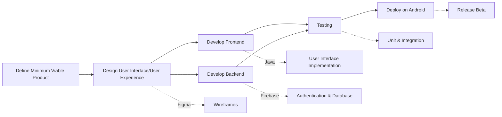
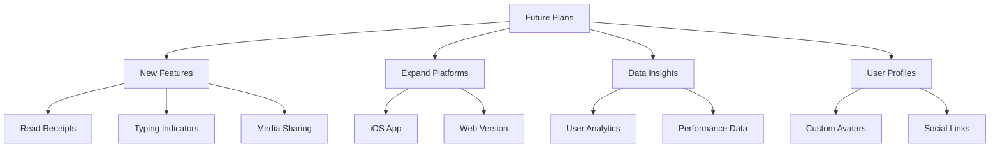

# Pulse: A Messaging platform for Seamless Communication

> Pulse is feature-rich messaging platform designed to deliver secure, scalable and efficient communication solutions with a user-centric approach while emphasizing user experience, security and extensibility.
> 

## Core Features

- Authentication
    
    Email or password login for secure access
    
    GitHub authentication planned as a future feature for enhanced flexibility
    
- Messaging
    
    Direct messaging for instant one-on-one communication
    
    Group chats for collaborative discussions among multiple users
    
- User Profile
    
    Enables users to create and manage basic profile information
    

## Technical Stack

- Frontend
    
    Java for android
    
- Backend
    
    Firebase (Realtime Database or Cloud Firestore) for authentication and real-time messaging
    

## Development Approach

- Agile Methodology
    
    Scrum : task development
    
    iterative development, continuous feedback
    
- Tools
    
    GitHub: version control
    
    Retool: task tracking
    
    WhatsApp: communication  
    

## Team Structure

- Design Team
    
    Create wireframes and mockups using Figma : define the app’s user friendly interface
    
- Android Development Team
    
    Develop using Flutter or Kotlin/Java for native android features : focus on UI/UX and core
    
- Backend Development Team
    
    Set up Firebase for authentication, syncing, 
    

---

### Development Process

---

## Additional Considerations

- **Scalability** : optimize for a growing user base
- **Security** : encrypt data and prepare 2FA integration
- **Feedback Loop**: collect user feedback for interactive methods
- **Documentation** : maintain technical guides for future updates

---

### Future Prospects

---

## Summary

- Pulse: Secure, scalable messaging platform for seamless communication
- Core features: Authentication, messaging, user profiles
- Tech stack: Java (Android), Firebase (backend)
- Development: Agile, Kanban, iterative with continuous feedback
- Process: MVP definition, UI/UX design, frontend/backend development, testing, deployment
- Future plans: Read receipts, typing indicators, media sharing, iOS/web versions, analytics
